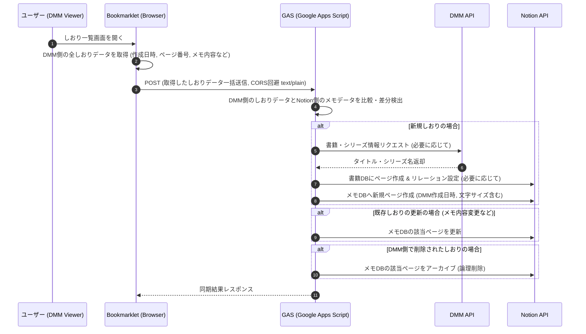

# 📚 DMM Books Notion Synchronizer

> **DMMブックスの読書メモ・しおりをNotionへリアルタイム自動同期するブックマークレット & GASバックエンド**


---

## 📌 概要
**DMM Books Notion Synchronizer** は、DMMブックスのWebビューア上で追加・編集・削除した「しおり」や「メモ」を、Notionデータベースへリアルタイムに自動同期するブラウザ・ブックマークレットおよびバックエンド連携システムです。

DMM APIとNotion APIを連携させることで、書籍のタイトルやシリーズ情報（親シリーズ）を自動取得・リレーション構造化し、読書体験を損なわずに読書ログやメモの一元管理を実現します。

---

## 💡 開発の背景・解決する課題

### 課題
*   **手動転記の手間**: 電子書籍で気になったページやメモを読書後にNotionへ書き直すのは手間がかかり、習慣化しづらい。
*   **情報の一元管理**: DMMブックスアプリ内だけでは、自分の知見や過去のメモを検索・横断参照するのが困難。

### 解決策
*   DMMブックスの「しおり一覧」画面オープン時に、ブックマークレットがDMM側のしおりデータを一括取得。バックエンド（GAS）を経由してNotionへ同期（追加・更新・アーカイブ）することで、手動転記の手間を解消。
*   書籍情報（タイトル、シリーズ等）はDMM APIから自動補完し、手動入力ゼロで整理された読書データベースを構築。

---

## 🏗️ システム構成 / アーキテクチャ



DMMブックスのWebビューアでユーザーが「しおり一覧」画面を開くと、ブックマークレットがDMM側の全しおりデータを一括で取得します。**以前の「追加ボタン押下時の即時通信」方式（個別送信リスナー）から、この「しおり一覧画面オープン時の一括同期（フルシンク）」方式へ移行し、DMM側のDOMを絶対的なマスターデータとして扱うことで、データ整合性と堅牢性を飛躍的に向上させました。**取得したデータには、しおりの「作成日時」やページ番号、メモ内容などが含まれます。取得したデータは、CORS回避のため `text/plain` 形式でGASバックエンドへ一括送信されます。

GASは、DMM側のしおりデータとNotion側の既存メモデータを「DMM作成日時」を主キーとして比較し、**Mapオブジェクトを用いた差分比較アルゴリズム（差集合計算による Create / Update / Delete の一括処理）により**差分を検出します。新規しおりが検出された場合は、必要に応じてDMM APIから書籍・シリーズ情報を取得し、Notionの書籍DBにページを作成・リレーション設定を行った上で、メモDBに新規ページを作成します。この際、NotionのメモDBには「DMM作成日時」と「文字サイズ」プロパティも記録されます。

既存しおりのメモ内容が変更された場合は、Notionの該当ページを更新します。DMM側でしおりが削除された場合は、Notionの対応するメモページをアーカイブ（論理削除）します。一連の処理が完了すると、GASからブックマークレットへ同期結果が返され、ユーザーに通知されます。

---

## ✨ 主な機能

1.  **しおり一覧画面オープン時の一括同期（新規追加）**
    *   DMMブックスの「しおり一覧」画面オープン時に、DMM側の全しおりデータを一括取得。Notionに未登録のしおりを検出し、NotionのメモDBに新規ページとして自動追加。この際、DMMブックス側で不変な「作成日時」をNotion側の主キーとして利用し、ページ番号やメモ内容、文字サイズなどの情報を記録します。
2.  **しおり一覧画面オープン時の一括同期（メモ更新）**
    *   「しおり一覧」画面オープン時に、DMM側のしおりデータとNotion側のメモデータを「DMM作成日時」をキーとして比較。メモ内容の変更を検出し、Notion側の対応するページ本文（引用ブロック）を更新します。
3.  **しおり一覧画面オープン時の一括同期（削除）**
    *   「しおり一覧」画面オープン時に、DMM側で削除されたしおりを検出し、Notion側の対応するメモページをアーカイブ処理（論理削除）します。
4.  **DMM APIによる書籍メタデータ自動補完 & リレーション構築**
    *   商品ID (`cid`) からDMM APIを呼び出し、書籍タイトル・シリーズ名を自動取得。
    *   Notion側で「書籍DB」と「メモDB」のリレーション構造を自動作成。
    *   NotionのメモDBには、**新アーキテクチャへの移行に伴い**、DMMブックス側で不変な「DMM作成日時」を主キーとして、また環境変化を記録するセーフティネットとして「文字サイズ」プロパティを**新たに追加**し、データ整合性と堅牢性を高めています。
5.  **同期ステータスの非干渉型トースト通知**
    *   バックグラウンドでの同期処理状況（成功/失敗）を、読書体験を阻害しない極小トーストで画面上部に表示。

---

## 🛠️ 技術スタック & 開発環境

| カテゴリ | 技術 / ツール | 用途 |
| :--- | :--- | :--- |
| **Frontend** | Vanilla JavaScript / TypeScript | DOM監視・イベントデリゲーション・ブックマークレット |
| **Backend** | Google Apps Script (GAS) / TypeScript | API中継、ロジック処理、CORS回避ハンドリング |
| **Tooling** | Google clasp / npm / copyfiles | GASビルド・デプロイ環境自動化 |
| **API** | Notion API / DMM Affiliate API | データベース操作 / メタデータ取得 |

---

## 💎 技術的なこだわり・工夫した点 (ポートフォリオ評価ポイント)

### 1. CORSエラー解消とPreflight抑制を両立した通信設計
GASのWeb Appへのブラウザからの非同期通信で発生する `401 Unauthorized` CORSエラーを解消するため、GASウェブアプリのアクセス権限を「全員 (Anyone)」に開放するインフラ設定を採用しました。これにより、ブラウザからの直接的なAPIリクエストが可能となり、より標準的な通信プロトコルでの連携を実現しています。また、`Content-Type: text/plain;charset=utf-8` を指定してリクエストを送信し、GAS側で `JSON.parse(e.postData.contents)` する構成も引き続き採用することで、Preflightリクエストの発生を抑制し、通信のオーバーヘッドを最小限に抑えています。この通信は、しおり一覧画面オープン時にDMM側の全しおりデータを一括送信する際に利用されます。**この際、フロントエンドからバックエンドへのデータ転送ペイロードは、しおりデータの配列と各しおりの「作成日時」プロパティを含むよう型定義を拡張し、データの一貫性と処理の堅牢性を高めています。**

### 2. MutationObserverとデバウンス処理による動的UIの安定監視
本システムでは、**しおり一覧画面のオープンをトリガー**とし、不確実なDOM描画タイミングを確実に捉えるため、単純な遅延処理ではなく **MutationObserver** を採用し、デバウンス処理を組み合わせたフルシンク検知ロジックを実装しています。これにより、動的なUI変更にも安定して対応し、DMMブックスビューアのShadow DOM内部要素から `event.composedPath()` や `shadowRoot` 経由で、**しおりの「作成日時」**、ページ番号、メモ内容、文字サイズなどの全データを正確に一括取得するロジックを実装しています。**文字サイズ変更に伴うページ番号のズレや、しおり名変更による参照キー喪失問題を根本的に解決するため、DMMブックス側で唯一不変な「作成日時」をNotion側の主キーとするアーキテクチャを採用しました。**これにより、データ整合性を飛躍的に向上させています。

### 3. データ整合性と再利用性を意識したNotion DB構造
書籍ごとにメモが紐づくだけでなく、「書籍」と「シリーズ」の階層構造もNotion上で自動構築するように設計。重複登録を防ぐ検索クエリロジック（`getOrCreateBookPage`）をバックエンドに組み込むとともに、書籍DBのページテンプレートにメモDBのリンクドビューを配置し、本ごとに自動フィルタリングされるUXを実現しています。特に、**新アーキテクチャへの移行に伴い、NotionのメモDBには「DMM作成日時」（主キー用）と「文字サイズ」（環境変化を記録するセーフティネット用）という新しいプロパティを新たに追加しました。**これにより、DMM側のDOM構造に依存しない堅牢なデータ連携を実現し、データ整合性を飛躍的に向上させています。GAS側（`NotionAPI.ts`）で指定するプロパティ名を実際のNotionデータベース構造（例: 「タイトル」「メモ名」「書籍DB」「親（シリーズ）」「DMM作成日時」「文字サイズ」）と完全に一致させることで、データ整合性を強化。同時に、Notion APIからの真のエラーレスポンスをフロントエンドへ透過的に返すようエラーハンドリングを強化し、デバッグ性とユーザーへのフィードバック精度を向上させています。**また、Notion APIとの連携を強化するため、柔軟な部分更新を可能にする `_patch` 関数を導入し、効率的なデータ更新を実現しています。**

### 4. セキュアな環境変数管理 (GAS PropertiesService)
APIキーなどの機密情報は、`Config.ts`への直書きを廃止し、GASの`PropertiesService`（スクリプトプロパティ）を用いてセキュアに管理するアーキテクチャを採用。Notionトークンは最新仕様の`ntn_`プレフィックスに準拠し、セキュリティとコード管理の堅牢性を高めています。

### 5. Notion APIバージョンの固定化
Notion APIの後方互換性を最大限に活用するため、APIバージョンは環境変数ではなくコード内に`2026-03-11`（最新安定版）としてハードコード。これにより、将来のAPI仕様変更による予期せぬ破損リスクと保守コストを排除し、システムの安定稼働を確保しています。

### 6. 非干渉型UIフィードバック
読書体験を阻害しないよう、同期ステータスを伝えるトースト通知は画面上部中央に極小サイズで表示し、`pointer-events: none` を適用することで、ユーザー操作に一切干渉しない設計を徹底しています。

### 7. オフラインキューシステムによる堅牢性向上
通信エラー発生時のデータロストを防ぐため、ブラウザの`localStorage`を活用したオフラインキューシステムを実装。ネットワークが不安定な状況でも、一時的にデータを退避・自動再送することで、同期処理の堅牢性と信頼性を大幅に向上させています。**本番環境でのNotion APIの一時的なダウン（503エラー）発生時にも、設計した「オフラインリトライキュー」が正常に稼働し、次回起動時に自動再送・同期が行われることを確認しました。これによりシステムの高い耐障害性（フォールトトレランス）が実証されています。**

### 8. Notion IDの厳密な正規化処理
Notion APIのエンドポイント仕様に起因する `400 Invalid request URL` エラーを回避するため、環境変数から取得したデータベースIDをハイフンなしの32桁の16進数形式に厳密に整形する `normalizeNotionId` 関数を実装しました。これにより、IDのフォーマット不一致によるAPIリクエスト失敗のリスクを排除し、システムの堅牢性を高めています。

### 9. TypeScript型定義の柔軟なハンドリング
Notion APIの複雑な戻り値構造に対し、開発効率とビルドの安定性を優先し、一部のAPIレスポンス処理において `any` 型を明示的に使用する判断を行いました。これにより、厳密な型定義に起因する開発の停滞を回避しつつ、主要なデータ構造には型安全性を維持しています。

---

## 🚀 セットアップ・使い方

### 事前準備
1.  [Notion API インテグレーション](https://www.notion.so/my-integrations) を作成し、内部統合トークンを取得。
2.  Notion上に「書籍データベース」と「メモデータベース」を作成し、トークンにアクセス権限を付与。
    *   メモデータベースには以下のプロパティを追加してください。
        *   `DMM作成日時` (Date型)
        *   `文字サイズ` (Number型)
3.  DMM Affiliate APIのアカウントを取得（`api_id`, `affiliate_id`）。

### バックエンド (GAS) のセットアップ

```bash
# クローンと依存パッケージのインストール
git clone https://github.com/<your-username>/<your-repository-name>.git
cd <your-repository-name>
npm install

# Google (clasp) へログイン認証
npx clasp login

# GASプロジェクトの紐付け (.clasp.json の scriptId を自身のGASプロジェクトIDに設定)
# 新規作成の場合: npx clasp create --title "DMMBooks Notion Sync" --type webapp --rootDir ./dist

# 環境変数の設定
# GASエディタを開き、「プロジェクトの設定」->「スクリプトプロパティ」から以下のキーと値を設定してください。
# - NOTION_TOKEN: [Notion API インテグレーションの内部統合トークン]
# - NOTION_BOOK_DB_ID: [Notion 書籍データベースのID]
# - NOTION_MEMO_DB_ID: [Notion メモデータベースのID]
# - DMM_API_ID: [DMM Affiliate APIのAPI ID]
# - DMM_AFFILIATE_ID: [DMM Affiliate APIのアフィリエイトID]

# ビルドおよび GAS へのデプロイ
npm run deploy

# GASウェブアプリのアクセス権限設定: デプロイ後、GASエディタの「デプロイ」->「デプロイを管理」から、ウェブアプリのアクセス権限を「全員 (Anyone)」に設定してください。また、最新のロジックが確実に反映されるよう、デプロイ時には必ず新しいバージョンを明示的に作成・選択してください。
```

### ブックマークレットの登録
1.  `bookmarklet.ts` 内の `GAS_URL` をデプロイしたGASのWeb App URLに変更。
2.  JSコードを1行に整形し、ブラウザのブックマークに登録。
3.  DMMブックス Webビューアを開いてブックマークレットを実行。

---

## 🔮 今後の展望 / 改善予定
- [ ] ビューア上の選択テキスト（ハイライト）の自動取得対応
- [ ] ブックマークレットのワンクリックインストール用ホスティングページ作成