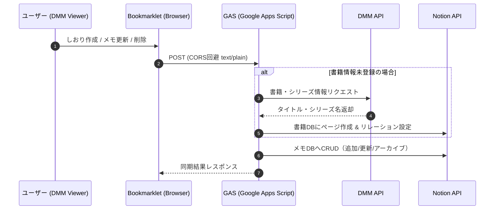

# 📚 DMM Books Notion Synchronizer

> **DMMブックスの読書メモ・しおりをNotionへリアルタイム自動同期するブックマークレット & GASバックエンド**


---

## 📌 概要
**DMM Books Notion Synchronizer** は、DMMブックスのWebビューア上で追加・編集・削除した「しおり」や「メモ」を、Notionデータベースへリアルタイムに自動同期するブラウザ・ブックマークレットおよびバックエンド連携システムです。

DMM APIとNotion APIを連携させることで、書籍のタイトルやシリーズ情報（親シリーズ）を自動取得・リレーション構造化し、読書体験を損なわずに読書ログやメモの一元管理を実現します。

---

## 💡 開発の背景・解決する課題

### 課題
* **手動転記の手間**: 電子書籍で気になったページやメモを読書後にNotionへ書き直すのは手間がかかり、習慣化しづらい。
* **情報の一元管理**: DMMブックスアプリ内だけでは、自分の知見や過去のメモを検索・横断参照するのが困難。

### 解決策
* DMMブックスの標準機能である「しおり」操作（追加・メモ編集・削除）をブックマークレットで検知し、バックエンド（GAS）を経由してNotionへ即座に反映。
* 書籍情報（タイトル、シリーズ等）はDMM APIから自動補完し、手動入力ゼロで整理された読書データベースを構築。

---

## 🏗️ システム構成 / アーキテクチャ



---

## ✨ 主な機能

1. **しおり追加のリアルタイム検知 & Notion登録**
   * View画面で「しおり追加」ボタンを押すと、現在ページ番号を取得してNotionのメモDBに自動追加。
2. **メモ（しおりテキスト）の更新同期**
   * しおり一覧でのテキスト入力・確定操作を検知し、Notion側のページ本文（引用ブロック）へ即座に反映。
3. **しおり削除の同期**
   * 削除操作（一括削除含む）を検知し、Notion側の対応するメモをアーカイブ処理（論理削除）。
4. **DMM APIによる書籍メタデータ自動補完 & リレーション構築**
   * 商品ID (`cid`) からDMM APIを呼び出し、書籍タイトル・シリーズ名を自動取得。
   * Notion側で「書籍DB」と「メモDB」のリレーション構造を自動作成。

---

## 🛠️ 技術スタック & 開発環境

| カテゴリ | 技術 / ツール | 用途 |
| :--- | :--- | :--- |
| **Frontend** | Vanilla JavaScript / TypeScript | DOM監視・イベントデリゲーション・ブックマークレット |
| **Backend** | Google Apps Script (GAS) / TypeScript | API中継、ロジック処理、CORS回避ハンドリング |
| **Tooling** | Google clasp / npm / copyfiles | GASビルド・デプロイ環境自動化 |
| **API** | Notion API / DMM Affiliate API | データベース操作 / メタデータ取得 |

---

## 💎 技術的なこだわり・工夫した点 (ポートフォリオ評価ポイント)

### 1. Preflight（CORS予備調査）を考慮した通信設計
GASのWeb Appに対してWebブラウザからCORSリクエストを送る際、標準的な `application/json` のヘッダーではOPTIONSリクエスト（Preflight）が発生し、エラーになる制約があります。
本プロジェクトでは `Content-Type: text/plain;charset=utf-8` を指定してリクエストを送信し、GAS側で `JSON.parse(e.postData.contents)` する構成を採用することで、**CORS制約をシームレスに回避**しています。

### 2. イベントデリゲーションによる動的UIの安定監視
DMMブックスのWebビューアは動的に要素が生成・変化するため、特定の単一要素へのイベントリスナー付与では取りこぼしが発生します。
ルート要素レベルでの**イベントデリゲーション**（`closest` による判定）および `aria-label` や属性値を活用した柔軟なDOMトリガー検知を実装しています。

### 3. データ整合性と再利用性を意識したNotion DB構造
書籍ごとにメモが紐づくだけでなく、「書籍」と「シリーズ」の階層構造もNotion上で自動構築するように設計。重複登録を防ぐ検索クエリロジック（`getOrCreateBookPage`）をバックエンドに組み込んでいます。

---

## 🚀 セットアップ・使い方

### 事前準備
1. [Notion API インテグレーション](https://www.notion.so/my-integrations) を作成し、内部統合トークンを取得。
2. Notion上に「書籍データベース」と「メモデータベース」を作成し、トークンにアクセス権限を付与。
3. DMM Affiliate APIのアカウントを取得（`api_id`, `affiliate_id`）。

### バックエンド (GAS) のセットアップ

```bash
# クローンと依存パッケージのインストール
git clone git@github.com:highkeyhaku-code/DMMBooks_Bookmarklet.git
cd DMMBooks_Bookmarklet
npm install

# 設定ファイルのコピーと編集
cp src/Config.example.ts src/Config.ts
# Config.ts 内の Notion Token, DB ID, DMM API ID 等を設定

# ビルドおよび GAS へのデプロイ
npm run deploy
```

### ブックマークレットの登録
1. `bookmarklet.ts` 内の `GAS_URL` をデプロイしたGASのWeb App URLに変更。
2. JSコードを1行に整形し、ブラウザのブックマークに登録。
3. DMMブックス Webビューアを開いてブックマークレットを実行。

---

## 🔮 今後の展望 / 改善予定
- [ ] ビューア上の選択テキスト（ハイライト）の自動取得対応
- [ ] ブックマークレットのワンクリックインストール用ホスティングページ作成
- [ ] 同期ステータスを画面上にトースト通知表示するUIフィードバックの強化
